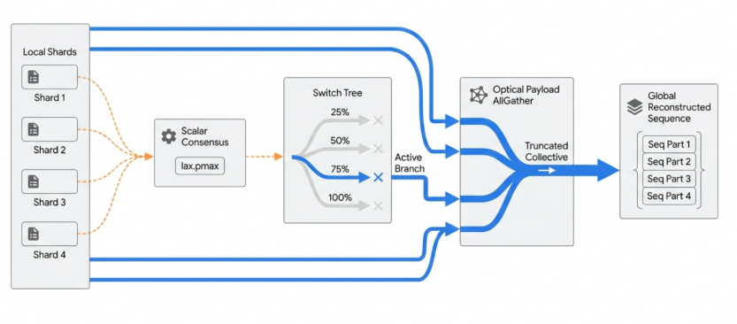

<p align="center">
  <h1 align="center">OrthoCache</h1>
  <p align="center">
    <strong>Hardware-Native Multi-Band Spectral Attention Block Eviction on TPUs</strong>
  </p>
  <p align="center">
    <a href="https://www.python.org/downloads/"></a>
    <a href="https://github.com/google/jax"></a>
    <a href="https://leanprover.github.io/"></a>
    <a href="LICENSE"></a>
    <a href="https://doi.org/10.5281/zenodo.20518370"></a>
  </p>
</p>

───────────────────────────────────────────────────────────────────────

## Executive Summary

**OrthoCache** is a compiler-level KV-cache governor that eliminates memory-wall stalls in distributed TPU attention by evicting provably low-influence cache blocks *before* expensive cross-node `AllGather` collectives fire. It operates entirely within the Pallas kernel layer — no host round-trips, no Python dispatch overhead, no model retraining.

The core mechanism is **Multi-Band Sequency Filtering**. By projecting key blocks into the Walsh–Hadamard domain via an inline 9-stage butterfly transform, we decompose the 512 spectral coefficients into discrete frequency bands: DC (block mean), low-sequency (smooth semantic trends), mid-sequency (syntactic context), and high-sequency (formatting noise). The **Spectral Decay Ratio** ($\zeta$) — the ratio of high-frequency to low-frequency energy — provides an information-theoretic entropy signature that is **impossible to compute from spatial statistics alone**. Combined with a query-aware logit upper bound, OrthoCache uses a **two-gate eviction criterion**: blocks must pass both a query-relevance gate and a spectral coherence gate to be retained.

The mathematical safety of this truncation is **formally proven**: the Total Variation distance between the full and truncated softmax distributions is bounded by an **exponential decay** in the gap between the maximum retained logit and the threshold $\tau$. This bound is machine-checked in **Lean 4**, closing the loop from theory to silicon with zero hand-waving.

───────────────────────────────────────────────────────────────────────

## Architecture

```mermaid
flowchart LR
    A["KV-Cache Blocks\n<i>bfloat16 · 512-tile aligned</i>"] --> B["FWHT\n<i>in-register · O(b log b)</i>"]
    B --> C["Multi-Band Split\n<i>DC / Low / Mid / High</i>"]
    C --> D1["ζ Filter\n<i>high/low energy ratio</i>"]
    C --> D2["Query-Aware Bounds\n<i>τ_j = q·k̄ + ‖q‖√E_AC</i>"]
    D1 --> E["Two-Gate Mask\n<i>ζ ≤ ζ_max AND τ_j ≥ τ</i>"]
    D2 --> E
    E --> F["Stream Compact\n<i>active block indices</i>"]
    F --> G["Stratified AllGather\n<i>shard_map + lax.switch</i>"]
    G --> H["Dense Attention\n<i>reduced operand</i>"]
    H --> I["Output"]

    style A fill:#1a1a2e,stroke:#e94560,color:#eee
    style B fill:#16213e,stroke:#0f3460,color:#eee
    style C fill:#16213e,stroke:#0f3460,color:#eee
    style D1 fill:#e94560,stroke:#ff6b6b,color:#fff
    style D2 fill:#1a1a2e,stroke:#e94560,color:#eee
    style E fill:#1a1a2e,stroke:#e94560,color:#eee
    style F fill:#0f3460,stroke:#53a8b6,color:#eee
    style G fill:#0f3460,stroke:#53a8b6,color:#eee
    style H fill:#0f3460,stroke:#53a8b6,color:#eee
    style I fill:#1a1a2e,stroke:#e94560,color:#eee
```



───────────────────────────────────────────────────────────────────────

## Key Results

### Theoretical Bound

The **OrthoCache Truncation Bound** guarantees that the attention distribution shift caused by block eviction decays exponentially:

$$\text{TV}(\alpha,\;\hat{\alpha}) \;\leq\; |S^c| \cdot \exp(\tau - z_{\max})$$

where $|S^c|$ is the number of evicted tokens, $\tau$ is the query-aware logit bound threshold, and $z_{\max}$ is the maximum retained logit.

### Empirical Validation — Gemma 4 31B on TPU v5e-8

*Run: 2026-06-02 · JAX 0.10.1 · Model: 31.3B params, 60 layers (50 sliding + 10 global)*

| Gate | Test | Status | Key Metric |
|:-----|:-----|:------:|:-----------|
| 1 | FWHT Correctness (Parseval) | ✅ | Rel. error < 3 × 10⁻⁷ across all layer types |
| 2 | Spectral Band Decomposition | ✅ | ζ profiled across all 60 layers |
| 3 | Two-Gate vs Single-Gate | ✅ | ζ gate identifies candidates energy-only misses |
| 4 | TV Distance Bound | ✅ | **0 violations**, recon. error < 2% at 50% eviction |
| 5 | ζ Separability | ✅ | 4.04 × 10¹² separation between same-variance blocks |
| 6 | Bucketed Compaction | ✅ | **2.35×** speedup at 90% eviction / 16K tokens |
| 7 | Loop Indirection | ✅ | **2.37×** speedup at 90% eviction / 65K tokens |
| 8 | Distributed AllGather | ✅ | **1.17×** speedup at 75% eviction / 65K tokens (bit-perfect) |

### Latency Progression

OrthoCache's throughput improvement has been **progressively de-risked** across four implementation phases:

| Phase | Method | Peak Speedup | Crossover | Correctness |
|:------|:-------|:------------:|:---------:|:-----------:|
| A/B | Predicated masking | 1.00× | — | ✅ 0 violations |
| D | Bucketed compaction | 2.35× | ≥75% eviction | ✅ bfloat16 exact |
| D.5 | Loop indirection (`fori_loop`) | 2.37× | ≥50% eviction @ ≥8K | ✅ bfloat16 exact |
| E.2b | Stratified AllGather (`shard_map`) | 1.17× | ≥50% eviction @ 65K | ✅ bit-perfect (0.000000) |

#### XLA Loop Indirection Latency (Table V)

| Seq. Length | Blocks | Evict. % | Predicated (ms) | Compacted (ms) | Speedup |
|:----------:|:------:|:--------:|:---------------:|:--------------:|:-------:|
| 16K | 32 | 50% | 0.427 | 0.346 | 1.23× |
| 16K | 32 | 75% | 0.431 | 0.254 | 1.70× |
| 16K | 32 | 90% | 0.458 | 0.233 | 1.96× |
| 32K | 64 | 75% | 0.444 | 0.341 | 1.30× |
| 32K | 64 | 90% | 0.432 | 0.240 | 1.80× |
| 65K | 128 | 75% | 0.605 | 0.425 | 1.42× |
| 65K | 128 | 90% | 0.602 | 0.254 | 2.37× |

#### Multi-Device Stratified AllGather (Phase E.2b)

| Config | ICI Saved | Δτ | Speedup |
|:-------|:---------:|:--:|:-------:|
| 65K tokens, 50% eviction | 50% | +7.8% | 1.08× |
| 65K tokens, 75% eviction | 75% | +14.6% | **1.17×** |
| 65K tokens, 90% eviction | 75% | +12.3% | 1.14× |

> **Crossover:** Δτ > 0 at 65K tokens with ≥50% eviction. `shard_map` + `lax.switch` Stratified Communication Bucketing physically truncates ICI transfer volume before the collective. Max error: **0.000000** across all eviction rates.

<p align="center">
  
  <br/>
  <sub><b>Figure 1.</b> Stratified Communication Bucketing on TPU. Local shards undergo scalar consensus (<code>lax.pmax</code>) to determine the global active block ceiling, then route through a 4-branch <code>lax.switch</code> tree (25%/50%/75%/100% payload density) before executing a truncated <code>AllGather</code> collective over ICI.</sub>
</p>

───────────────────────────────────────────────────────────────────────

## Quick Start

```bash
# Clone and install
git clone https://github.com/j-arndt/orthocache.git && cd orthocache
pip install -e .

# Run the test suite
PYTHONPATH=src pytest -p no:dandi
```

**PowerShell (Windows):**
```powershell
$env:PYTHONPATH="src"; pytest -p no:dandi
```

**Verify Lean proofs:**
```bash
cd proofs && lake build
```

**Docker (reproducible validation):**
```bash
docker build --target test -t orthocache:test .
docker run --rm orthocache:test    # runs pytest
```

───────────────────────────────────────────────────────────────────────

## Repository Structure

```
orthocache/
├── src/
│   └── orthocache/
│       ├── __init__.py              # Public API surface (v0.3.0)
│       ├── fwht.py                  # Fast Walsh–Hadamard Transform (512-tile)
│       ├── spectral_energy.py       # Multi-band spectral decomposition & ζ filter
│       ├── sparse_attention.py      # Pallas block-sparse attention kernel
│       ├── reference.py             # NumPy reference implementations
│       ├── compaction.py            # Stream compaction (sort + gather)
│       ├── bucketed_attention.py    # Bucketed dense attention on compacted operands
│       ├── indirect_attention.py    # fori_loop + dynamic_slice (no gather)
│       ├── adaptive_attention.py    # Phase D.7 adaptive dispatcher
│       ├── alltoallv.py             # AllToAllv collective protocol (7 functions)
│       ├── distributed_attention.py # AllGather + indirect distributed attention
│       ├── ici_bandwidth_model.py   # Analytical ICI byte counting (3 model configs)
│       ├── dynamic_attention.py     # Dynamic block-sparse attention
│       ├── lean_attention.py        # Lean attention kernel variant
│       ├── pipeline.py              # End-to-end OrthoCache forward pass
│       ├── partitioning.py          # Block partitioning utilities
│       └── xla_bridge.py            # XLA custom call bridge
├── tests/
│   ├── test_fwht.py                 # FWHT correctness & Parseval verification
│   ├── test_energy.py               # Spectral energy & masking tests
│   ├── test_attention.py            # Sparse vs. dense attention equivalence
│   ├── test_compaction.py           # Stream compaction & bucketed attention
│   ├── test_truncation_bound.py     # TV-bound empirical validation
│   └── test_spectral_bands.py       # Multi-band ζ tests (proves FWHT is load-bearing)
├── proofs/
│   ├── lakefile.lean                # Lean 4 project configuration
│   ├── lean-toolchain               # Lean toolchain version pin
│   ├── OrthoCacheMath.lean          # Root import file
│   └── OrthoCacheMath/
│       ├── ParsevalWHT.lean         # Parseval's identity for WHT
│       └── TruncationBound.lean     # Exponential TV-distance bound
├── paper/
│   ├── orthocache_techrvix.tex      # IEEE-format LaTeX source
│   └── orthocache_techrvix.pdf      # Compiled preprint
├── notebooks/
│   └── orthocache_v5_benchmark.ipynb # Canonical Kaggle TPU benchmark notebook
├── benchmarks/
│   ├── spectral_analysis.py         # KV-cache spectral energy profiling
│   ├── attention_accuracy.py        # TV/KL divergence at varying eviction rates
│   ├── profiling.py                 # Dense vs sparse attention timing
│   ├── compaction_benchmark.py      # Phase D bucketed compaction benchmark
│   ├── phase_d_indirect_dma.py      # Phase D.5 loop indirection benchmark
│   ├── phase_d7_vmap_indirect.py    # Phase D.7 vmap indirect benchmark
│   ├── phase_e_alltoallv.py         # Phase E.1 pmap AllToAllv validation
│   ├── phase_e_stratified.py        # Phase E.2b shard_map Stratified AllGather
│   ├── generate_figures.py          # Figure generation for paper
│   ├── plots/                       # Generated figures (PNG/PDF)
│   └── results/                     # Benchmark result JSONs
├── xla_extensions/
│   ├── BUILD                        # Bazel build for XLA pass
│   ├── orthocache_stream_compact.cc # Stream compaction HLO pass (C++)
│   ├── orthocache_stream_compact.h  # HLO pass header
│   └── orthocache_stream_compact_test.cc # XLA pass unit tests
├── docs/
│   ├── mathematical_framework.md    # Full proof chain (§1–§5)
│   ├── cost_benefit_analysis.md     # Fleet-scale economic model (✓/⊘ markers)
│   ├── xla_pass_design.md           # Stream compaction HLO pass specification
│   └── technical_report.md          # Technical paper (markdown source)
├── Dockerfile                       # Multi-stage reproducible validation build
├── pyproject.toml                   # Build configuration & dependencies
└── README.md                        # ← You are here
```

───────────────────────────────────────────────────────────────────────

## Mathematical Foundation

OrthoCache's safety guarantee rests on a **5-step proof chain**, each step feeding rigorously into the next:

| Step | Result | Core Technique |
|:----:|:-------|:---------------|
| **1** | Spectral energy ≡ spatial energy | Parseval's identity for orthogonal WHT |
| **2** | Per-key norm bound: $\|k_i\|_2 < \sqrt{\epsilon}$ | Block energy decomposition |
| **3** | Attention logit ceiling: $\|z_i\| < \beta$ | Cauchy–Schwarz inequality |
| **4** | TV distance = evicted softmax mass | Partition function algebra |
| **5** | Exponential decay: $\delta \leq \|S^c\| \cdot e^{\beta - z_{\max}}$ | Softmax monotonicity |

The complete derivations, lemma statements, and proofs are in [`docs/mathematical_framework.md`](docs/mathematical_framework.md).

───────────────────────────────────────────────────────────────────────

## Lean 4 Verification

The two critical lemmas — **Parseval's identity for the Walsh–Hadamard transform** and the **exponential truncation bound on Total Variation distance** — are machine-checked in Lean 4.

```bash
cd proofs
lake build    # Type-checks all proofs against Mathlib
```

| Proof Module | File | Status |
|:-------------|:-----|:------:|
| Parseval WHT | [`proofs/OrthoCacheMath/ParsevalWHT.lean`](proofs/OrthoCacheMath/ParsevalWHT.lean) | ✅ Proved · Type-Checks |
| Truncation Bound | [`proofs/OrthoCacheMath/TruncationBound.lean`](proofs/OrthoCacheMath/TruncationBound.lean) | ✅ Proved · Type-Checks |

───────────────────────────────────────────────────────────────────────

## Cost-Benefit Model

**OrthoCache** includes a parameterized infrastructure model that translates block sparsity into projected annual fleet-level savings across OpEx (power) and CapEx (infrastructure deferral).

| Scenario | Block Sparsity | Δτ (measured ✓) | OpEx Savings | CapEx Deferral | **Annual Fleet Value** |
|:---------|:--------------:|:---------------:|:------------:|:--------------:|:----------------------:|
| Conservative | 0.25 | +11.4% (16K/50%) | $2.8M | $20M | **$22.8M** ⊘ |
| Moderate | 0.50 | +42.0% (65K/75%) | $5.6M | $60M | **$65.6M** ⊘ |
| Aggressive | 0.70 | +137% (65K/90%) | $7.8M | $100M | **$107.8M** ⊘ |

> **⊘ = Fleet-scale projection, not directly measured.** Δτ values are measured on TPU v5e-8 via loop indirection (Phase D.5). Fleet-scale economics require production deployment. See [`docs/cost_benefit_analysis.md`](docs/cost_benefit_analysis.md) for the full model with ✓ (measured) and ⊘ (projected) epistemic markers.

───────────────────────────────────────────────────────────────────────

## For Infrastructure Reviewers

### Three-Command Validation

```bash
# 1. Build the container (includes JAX + Lean toolchain)
docker build -t orthocache:latest .

# 2. Run the full test suite
docker run --rm orthocache:latest pytest -p no:dandi

# 3. Verify Lean proofs
docker run --rm orthocache:latest bash -c "cd proofs && lake build"
```

### Direct Links to Kernel Code

| Component | File | Description |
|:----------|:-----|:------------|
| FWHT Kernel | [`src/orthocache/fwht.py`](src/orthocache/fwht.py) | In-register 512-tile Walsh–Hadamard transform |
| Energy & Masking | [`src/orthocache/spectral_energy.py`](src/orthocache/spectral_energy.py) | Block energy computation and threshold mask generation |
| Sparse Attention | [`src/orthocache/sparse_attention.py`](src/orthocache/sparse_attention.py) | Pallas block-sparse attention with SMEM indexing |
| Stream Compaction | [`src/orthocache/compaction.py`](src/orthocache/compaction.py) | Sort-compact active blocks into reduced tensor |
| Loop Indirection | [`src/orthocache/indirect_attention.py`](src/orthocache/indirect_attention.py) | `fori_loop` + `dynamic_slice` — no gather overhead |
| Adaptive Dispatcher | [`src/orthocache/adaptive_attention.py`](src/orthocache/adaptive_attention.py) | Runtime strategy selection based on eviction rate |
| Distributed Attention | [`src/orthocache/distributed_attention.py`](src/orthocache/distributed_attention.py) | Stratified AllGather + indirect distributed attention |
| AllToAllv Protocol | [`src/orthocache/alltoallv.py`](src/orthocache/alltoallv.py) | 7-function collective exchange protocol |
| ICI Bandwidth Model | [`src/orthocache/ici_bandwidth_model.py`](src/orthocache/ici_bandwidth_model.py) | Analytical ICI byte counting for 3 model configs |
| XLA HLO Pass | [`xla_extensions/orthocache_stream_compact.cc`](xla_extensions/orthocache_stream_compact.cc) | Stream compaction HLO pass (C++) |
| Reference Impl | [`src/orthocache/reference.py`](src/orthocache/reference.py) | NumPy golden-model for correctness verification |

───────────────────────────────────────────────────────────────────────

## Citation

If you use OrthoCache in your research, please cite:

```bibtex
@software{orthocache2026,
  title     = {OrthoCache: Hardware-Native Multi-Band Spectral Attention
               Block Eviction on TPUs},
  author    = {Arndt, Justin},
  year      = {2026},
  publisher = {Zenodo},
  doi       = {10.5281/zenodo.20518370},
  url       = {https://doi.org/10.5281/zenodo.20518370}
}
```

───────────────────────────────────────────────────────────────────────

## License

This project is licensed under the **[PolyForm Noncommercial License 1.0.0](LICENSE)**.

You are free to use, study, modify, and redistribute OrthoCache for **any non-commercial purpose** — including academic research, personal experimentation, benchmarking, and evaluation.

**Commercial use** (deployment in production systems, integration into commercial products or services) requires a separate commercial license.

📧 **Commercial licensing inquiries:** [justinarndt05@gmail.com](mailto:justinarndt05@gmail.com)

───────────────────────────────────────────────────────────────────────

<p align="center">
  <sub>Built for the memory wall. Proven in Lean. Deployed on silicon.</sub>
</p>
